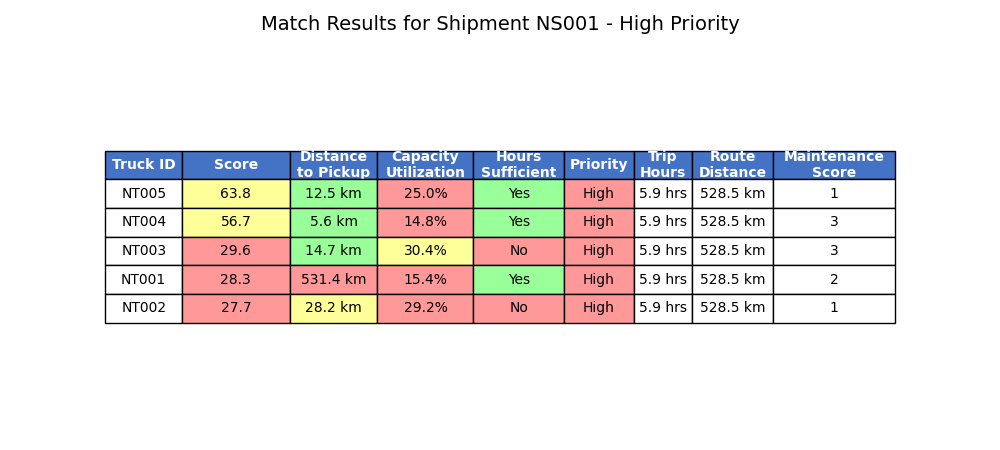
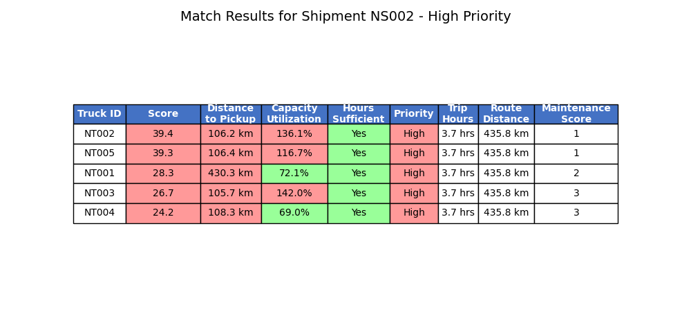

# TruQ Trip Matching System

An ML-based system for optimizing truck-shipment matching in middle-mile logistics.

## Solution

This prototype demonstrates the core ML system I developed in collaboration with our Data Science team to solve TruQ's truck-shipment matching challenge.

The system uses a machine learning model to predict optimal matches between available trucks and pending shipments based on multiple features:

- Truck location and capacity
- Shipment weight and dimensions
- Driver availability
- Distance calculations
- Delivery deadlines
- Historical performance

## Installation

```bash
poetry install
poetry run trip-matcher -v
```

```bash
docker build -t truq-trip-matching .
docker run -v $(pwd)/output:/app/output truq-trip-matching
```

## Project Structure

```
tr-presentation/
├── pyproject.toml
├── README.md
└── trip_matching/
    └── main.py
```

## Demo

The main.py file demonstrates:

1. Generation of synthetic data representing trucks and shipments
2. Feature engineering for potential matches
3. Training of the matching model using historical data
4. Prediction of optimal matches using the trained model
5. Selection and presentation of the best matches

This prototype serves as a simplified version of the production system deployed at TruQ.

## Metrics

R2 coefficient of determination tracks "our model captures X% of what makes a good truck-shipment match"
RMSE = 10 would mean your predicted match scores are, on average, 10 points off from the true optimal score

1. distance_to_pickup_km: 0.6872
2. driver_hours_sufficient: 0.2006
3. maintenance_status_score: 0.0897
4. priority_high: 0.0134
5. capacity_utilization: 0.0045

## Test Run



